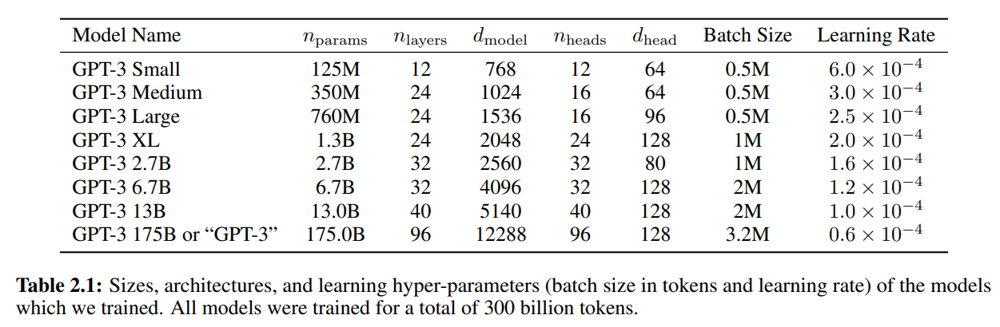

这个项目是使用Python和PyTorch构建的，它实现了一个简单的GPT-2模型，用于文本生成。以下是一些重要的文件和目录：

[GPT2论文](https://insightcivic.s3.us-east-1.amazonaws.com/language-models.pdf)

[GPT3论文地址](https://arxiv.org/abs/2005.14165)

**期望损失值**：在完全随机的情况下，如果词汇表总量为50126，那么预测下一次的单词的期望损失值为：`-ln(1/50257)=10.82`。

## 对 forward 函数的思考

```python
def forward(self, idx, targets=None):
    # idx is of shape (B, T)
    B, T = idx.size()
    assert T <= self.config.block_size, f"Cannot forward sequence of length {T}, block size is only {self.config.block_size}"
    # forward the token and posisition embeddings
    pos = torch.arange(0, T, dtype=torch.long, device=idx.device) # shape (T)
    pos_emb = self.transformer.wpe(pos) # position embeddings of shape (T, n_embd)
    tok_emb = self.transformer.wte(idx) # token embeddings of shape (B, T, n_embd)
    x = tok_emb + pos_emb
    # forward the blocks of the transformer
    for block in self.transformer.h:
        x = block(x)
    # forward the final layernorm and the classifier
    x = self.transformer.ln_f(x)
    logits = self.lm_head(x) # (B, T, vocab_size)
    loss = None
    if targets is not None:
        # logits.view(-1, logits.size(-1))：将所有批次的logits展平，然后和targets展平
        loss = F.cross_entropy(logits.view(-1, logits.size(-1)), targets.view(-1))
    return logits, loss
```

这是一个GPT-2模型的forward函数，它接收一个批次的索引（input）和目标（targets）。input和target都是一个形状为(B, T)的矩阵，其中B是批次大小，T是序列长度。但是input在经过计算之后形状变为了(B, T, n_embd)，其中n_embd为vocab_size，就是词表的长度，而targets的形状没有变化。

1. 输入数据其实是一个很长的text文档，我们为什么要将其转变为一个矩阵呢？
因为我们希望从文本序列中学习到规律，所以我们需要将原本的一个很长的文本序列，切分成一些小块，每一小块都是堆叠的形状，每一行就是一个序列，行数就是batchsize的大小。

2. 为什么在最后计算loss的时候要将logits.view(-1, logits.size(-1)) ，targets.view(-1)？
将两者展平之后，计算交叉熵损失时，计算的是每一个单词预测下一个词的准确性。也就是说，模型从序列中学习到规律，而最终计算损失时，是看每一个词预测下一个词的准确性。

## 为什么要在参数初始化的时候除以$\sqrt{N}$？

GPT2原文： We scale the weights of residual layers at initialization by a factor of 1/√N where N is the number of residual layers. 

在GPT-2模型中，参数初始化时，通常会使用正态分布初始化参数，并除以一个缩放因子$\sqrt{N}$，其中$N$是参数的维度。这个缩放因子是为了防止初始化的参数过大，导致训练过程不稳定。

举例来说，如果不除以$\sqrt{N}$，那么初始化的参数的方差可能会很大，导致训练过程不稳定。

```python
import torch
x = torch.zeros(768)
n = 100 # 假设有100层
for i in range(n):
    x += torch.randn(768)
print(x.std()) # tensor(9.5679)
```

除以$\sqrt{N}$之后，方差将会减小，使得训练过程更加稳定。

```python
x = torch.zeros(768)
n = 100
for i in range(n):
    x += n**-0.5 * torch.randn(768)
print(x.std()) # tensor(0.9772)
```

所以在代码中，进行了如下操作：

```python
def _init_weights(self, module):
    if isinstance(module, nn.Linear):
        std = 0.02
        if hasattr(module, 'NANOGPT_SCALE_INIT'):
            std *= (2 * self.config.layer)**-0.5
        torch.nn.init.normal_(module.weight, mean=0.0, std=std)
        if module.bias is not None:
            torch.nn.init.zeros_(module.bias)
    elif isinstance(module, nn.Enbedding):
        torch.nn.init.normal_(module.weight, mean=0.0, std=0.02)
```

其中，将self.config.layer乘以2，原因是在每一个block中，我们要进行两次残差连接

## nvidia显卡的浮点精度

### 显卡浮点数精度是什么？

在浮点数表示中，数值由三个部分组成：符号位、指数部分和尾数部分（通常称为精度部分）。每个部分在数值的表示和计算中扮演着不同的角色：

1. 符号位：

    - 符号位决定了数字的正负，一位数字，0代表正数，1代表负数。

2. 指数部分：

    - 指数部分决定了数值的范围或者说数值的量级。
    - 在二进制浮点数表示中，指数通常是以偏移的形式存储的。这意味着实际的指数值是存储值减去一个偏移量（例如，对于32位浮点数，偏移量通常是127）。
    - 指数的宽度决定了数值可以表示的范围，也即是可以表示多大或多小的数。较宽的指数范围允许表示更大或更小的数值，但以牺牲尾数部分的宽度为代价，可能会影响到精度。

3. 尾数部分（精度部分）：

    - 尾数部分存储实际的数值信息，决定了数字的精度。
    - 尾数是浮点数的基数部分，在二进制中通常以1.xxxx的形式隐式表示，其中“1”是隐式的，后面的“xxxx”是显式存储的。这种表示方式称为规格化形式。
    - 尾数的宽度决定了数值的精确度，即能够区分多接近的两个数值。尾数越宽，能表示的数值就越精确。

在深度学习和其他高性能计算任务中，精度和性能之间需要进行权衡。例如，FP32提供较高的精度但计算成本高；而FP16和BF16牺牲了一些精度以换取更快的运算速度和更低的内存需求。在设计算法和选择硬件时，开发者需要根据具体的应用需求和硬件能力来选择合适的浮点数表示方式。

### nvidia显卡有哪些浮点精度？

这里有[关于浮点数的详解](https://moocaholic.medium.com/fp64-fp32-fp16-bfloat16-tf32-and-other-members-of-the-zoo-a1ca7897d407)，[nvidia官方解释](https://developer.nvidia.com/blog/accelerating-ai-training-with-tf32-tensor-cores/)，[官方文档](https://images.nvidia.com/aem-dam/en-zz/Solutions/data-center/nvidia-ampere-architecture-whitepaper.pdf)

1. FP32（32位浮点数）：

    - FP32是最常用的精度类型，提供很高的数值精度和稳定性。
    - 适用于需要高精度计算的应用，比如科学计算和精确的数值模拟。
    - 在没有专门硬件加速的情况下，大多数设备上的默认计算精度。

2. TF32（Tensor Float 32）：

    - TF32是由NVIDIA为其Ampere架构GPU设计的一种新的数值格式。
    - 它在内部使用与FP32相同的尾数宽度，但指数范围更短。
    - TF32旨在提供与FP32相似的精度，同时在深度学习训练中提供更高的性能。

3. FP16（16位浮点数）：

    - FP16是一种较低的精度格式，减少了内存的使用和数据传输的需求。
    - 它在一些深度学习应用中足够用来训练网络，尤其是在有专门硬件支持的情况下，如NVIDIA的Tensor Cores。
    - FP16可以加快训练速度并减少功耗，但可能需要特别的数值稳定技术，如梯度缩放。

4. BF16（BFloat16）：

    - 使用较多的精度格式，与FP16类似，但精度更高。
    - BF16是一种16位格式，与FP16相比，它保持了与FP32相同宽度的指数部分，但减少了尾数的精度。
    - 这种格式特别适用于深度学习，因为它提供足够的动态范围来处理深度学习应用中的数值，同时可以减少模型的内存占用和提高处理速度。
    - BF16在谷歌的TPU和最新的Intel和AMD处理器中得到支持。


### v100(16GB)与3090(24GB)的浮点精度有什么区别？

v100(16GB)不支持BF16，而3090(24GB)支持BF16。

## 深度学习中的单精度和双精度的区别

单精度（Single Precision）和双精度（Double Precision）是计算机科学中用于表示数字的二进制格式。它们都是用于存储数字的二进制格式，但两者之间的区别在于位数。

| 单精度（Single Precision） | 双精度双精度（Double Precision） |
| ----------- | ----------- |
| 使用32位来表示浮点数，其中1位用于符号，8位用于指数，23位用于尾数 | 使用64位来表示浮点数，其中1位用于符号，11位用于指数，52位用于尾数 |
| 32位（4字节） | 64位（8字节） |
|内存使用量和计算资源消耗更小，训练速度较快|内存使用量和计算资源消耗更大，导致训练速度较慢|
|大多数现代GPU对单精度浮点数的处理具有优化，特别是NVIDIA的CUDA核心，可以提供专门的单精度计算单元，使得单精度运算的速度远远超过双精度|双精度运算在某些GPU上也得到支持，但往往速度较慢，且不是所有GPU都具有高效的双精度计算能力|
| 神经网络中使用 | 天文学计算、气候模型中使用 |

双精度：


单精度：


半精度：


## 混合精度训练

pytorch默认使用的精度是torch.float32，但是如果完全使用这种精度训练模型，会导致速度偏慢，如果使用torch.bfloat16，可以大大提高训练速度，但是bfloat16精度有限，不能完全替代float32。因此出现了混合精度训练模式。

以下是[pytorch官方](https://pytorch.org/tutorials/recipes/recipes/amp_recipe.html)关于混合精度训练的介绍：

torch.cuda.amp provides convenience methods for mixed precision, where some operations use the torch.float32 (float) datatype and other operations use torch.float16 (half). Some ops, like linear layers and convolutions, are much faster in float16 or bfloat16. Other ops, like reductions, often require the dynamic range of float32. Mixed precision tries to match each op to its appropriate datatype, which can reduce your network’s runtime and memory footprint.

### 使用torch.autocast进行混合精度训练

In these regions, CUDA ops run in a dtype chosen by autocast to improve performance while maintaining accuracy. See the [Autocast Op Reference](https://pytorch.org/docs/stable/amp.html#autocast-op-reference) for details on what precision autocast chooses for each op, and under what circumstances.

```python
for epoch in range(0): # 0 epochs, this section is for illustration only
    for input, target in zip(data, targets):
        # Runs the forward pass under ``autocast``.
        with torch.autocast(device_type=device_type, dtype=torch.float16):
            output = net(input)
            # output is float16 because linear layers ``autocast`` to float16.
            assert output.dtype is torch.float16

            loss = loss_fn(output, target)
            # loss is float32 because ``mse_loss`` layers ``autocast`` to float32.
            assert loss.dtype is torch.float32

        # Exits ``autocast`` before backward().
        # Backward passes under ``autocast`` are not recommended.
        # Backward ops run in the same ``dtype`` ``autocast`` chose for corresponding forward ops.
        loss.backward()
        opt.step()
        opt.zero_grad() # set_to_none=True here can modestly improve performance
```

⚠️ 注意：`device_type`代表的是设别类型，可以取值：`"cuda","cpu","xpu"`等，而不能设置为`cuda:0`，如果要将model放置在`cuda:0`上，需要提前对设置`model.to(device)`。

torch.autocast会自动地将模型内部矩阵计算使用float16（也可以改为bfloat16），而最终的损失计算时，精度为float32。下面是更详细的关于pytorch如何自动地设置精度类型的介绍：

- CUDA Ops that can autocast to float16：

__matmul__, addbmm, addmm, addmv, addr, baddbmm, bmm, chain_matmul, multi_dot, conv1d, conv2d, conv3d, conv_transpose1d, conv_transpose2d, conv_transpose3d, GRUCell, linear, LSTMCell, matmul, mm, mv, prelu, RNNCell

- CUDA Ops that can autocast to float32：

__pow__, __rdiv__, __rpow__, __rtruediv__, acos, asin, binary_cross_entropy_with_logits, cosh, cosine_embedding_loss, cdist, cosine_similarity, cross_entropy, cumprod, cumsum, dist, erfinv, exp, expm1, group_norm, hinge_embedding_loss, kl_div, l1_loss, layer_norm, log, log_softmax, log10, log1p, log2, margin_ranking_loss, mse_loss, multilabel_margin_loss, multi_margin_loss, nll_loss, norm, normalize, pdist, poisson_nll_loss, pow, prod, reciprocal, rsqrt, sinh, smooth_l1_loss, soft_margin_loss, softmax, softmin, softplus, sum, renorm, tan, triplet_margin_loss

### 使用GradScaler进行梯度缩放

在使用torch.autocast进行混合精度训练时，一般配合使用GradScaler进行梯度缩放，以防止梯度爆炸和梯度消失，

```python
# Constructs a ``scaler`` once, at the beginning of the convergence run, using default arguments.
# If your network fails to converge with default ``GradScaler`` arguments, please file an issue.
# The same ``GradScaler`` instance should be used for the entire convergence run.
# If you perform multiple convergence runs in the same script, each run should use
# a dedicated fresh ``GradScaler`` instance. ``GradScaler`` instances are lightweight.
scaler = torch.cuda.amp.GradScaler()

for epoch in range(0): # 0 epochs, this section is for illustration only
    for input, target in zip(data, targets):
        with torch.autocast(device_type=device, dtype=torch.float16):
            output = net(input)
            loss = loss_fn(output, target)

        # Scales loss. Calls ``backward()`` on scaled loss to create scaled gradients.
        scaler.scale(loss).backward()

        # ``scaler.step()`` first unscales the gradients of the optimizer's assigned parameters.
        # If these gradients do not contain ``inf``s or ``NaN``s, optimizer.step() is then called,
        # otherwise, optimizer.step() is skipped.
        scaler.step(opt)

        # Updates the scale for next iteration.
        scaler.update()

        opt.zero_grad() # set_to_none=True here can modestly improve performance
```

也可以使用下列方法控制是否使用torch.autocast和GradScaler

```python
use_amp = True # 若为False，则不使用torch.autocast和GradScaler

net = make_model(in_size, out_size, num_layers)
opt = torch.optim.SGD(net.parameters(), lr=0.001)
scaler = torch.cuda.amp.GradScaler(enabled=use_amp)

start_timer()
for epoch in range(epochs):
    for input, target in zip(data, targets):
        with torch.autocast(device_type=device, dtype=torch.float16, enabled=use_amp):
            output = net(input)
            loss = loss_fn(output, target)
        scaler.scale(loss).backward()
        scaler.step(opt)
        scaler.update()
        opt.zero_grad() # set_to_none=True here can modestly improve performance
end_timer_and_print("Mixed precision:")
```

## 使用torch.compile加速

[官方教程](https://pytorch.org/tutorials/intermediate/torch_compile_tutorial.html)

torch.compile是一个实验性功能，用于加速PyTorch模型。它使用JIT编译器将PyTorch模型转换为C++代码，从而提高模型的运行速度。

只需一行代码即可使用：`model=torch.compile(model)`，示例如下：

```python
class MyModule(torch.nn.Module):
    def __init__(self):
        super().__init__()
        self.lin = torch.nn.Linear(100, 10)

    def forward(self, x):
        return torch.nn.functional.relu(self.lin(x))

mod = MyModule()
opt_mod = torch.compile(mod)
print(opt_mod(torch.randn(10, 100)))
```

**为什么torch.compile可以实现加速？**

Speedup mainly comes from reducing Python overhead and GPU read/writes, and so the observed speedup may vary on factors such as model architecture and batch size. 

加速原理就是减少GPU计算单元和显存之间的通信次数。在一般的python程序中，代码被一行一行地执行，每次执行都会将数据从显存传输到GPU计算单元，计算完成之后就从GPU计算单元传输到显存，随后进行下一行代码的计算。而torch.compile会通读整个python代码，减少read/write次数，从而减少python的运行时间，同时减少显存占用，从而加速模型运行。

**遇到报错**

==未解决==


```
/usr/bin/ld: skipping incompatible /lib/i386-linux-gnu/libcuda.so when searching for -lcuda
/usr/bin/ld: skipping incompatible /lib/i386-linux-gnu/libcuda.so when searching for -lcuda
/usr/bin/ld: cannot find -lcuda
collect2: error: ld returned 1 exit status
```

[解决方案](https://github.com/pytorch/pytorch/issues/94585)

1. run `ldconfig -p|grep libcuda`
2. create a soft link `ln -s /usr/lib/x86_64-linux-gnu/libcuda.so.1 /usr/bin/libcuda.so`

==未解决==

运行如下代码都不会出现问题，不知道为什么：

```python
import torch
class MyModule(torch.nn.Module):
    def __init__(self):
        super().__init__()
        self.lin = torch.nn.Linear(100, 10)

    def forward(self, x):
        return torch.nn.functional.relu(self.lin(x))

mod = MyModule()
opt_mod = torch.compile(mod)
print(opt_mod(torch.randn(10, 100)))
```

```cmd
python -c 'import torch; import torchvision; x=torch.ones(1,3,224,224); model=torchvision.models.resnet50(); compiled=torch.compile(model); compiled(x)'
```

## FlashAttention加速

[论文地址](https://arxiv.org/abs/2205.14135)

FlashAttention，这是一种具有 IO 感知能力的精确注意力算法，它使用分块技术来减少 GPU 高带宽内存（HBM）和 GPU 芯片上 SRAM 之间的内存读写次数，在 GPT-2（序列长度 1K）上实现了 3 倍加速。

使用flash_attention，只需将原来的attention代码替换为torch中实现了的flash_attention即可，示例如下：

原始attention：
```python
att = (q @ k.transpose(-2, -1)) * (1.0/math.sqrt(k.size(-1)))
att = att.masked_fill(self.bias[:,:,:T,:T] == 0, float('-inf'))
att = F.softmax(att, dim=-1)
y = att @ v # (B, nh, T, T) x (B, nh, T, hs) -> (B, nh, T, hs)
```

flash_attention：
```python
y = F.scaled_dot_product_attention(q, k, v, is_causal=True) # flash attention
```

## 2的幂次方

在深度学习中，所有的数字尽量使用2的幂次方，因为GPU的显存大小是2的幂次方，这样可以减少显存占用，从而加速模型运行。

因此将vocab_size从50257修改为50304=128*393，这可以小幅提升训练速度。

## 参考GPT3进行一些超参数的设置

[GPT3论文地址](https://arxiv.org/abs/2005.14165)

原文：

To train all versions of GPT-3, we use Adam with β1 = 0.9, β2 = 0.95, and eps = 10−8, we clip the global norm of the gradient at 1.0, and we use cosine decay for learning rate down to 10% of its value, over 260 billion tokens (after 260 billion tokens, training continues at 10% of the original learning rate). There is a linear LR warmup over the first 375 million tokens. We also gradually increase the batch size linearly from a small value (32k tokens) to the full value over
the first 4-12 billion tokens of training, depending on the model size. Data are sampled without replacement during training (until an epoch boundary is reached) to minimize overfitting. All models use weight decay of 0.1 to provide a small amount of regularization [LH17].

During training we always train on sequences of the full nctx = 2048 token context window, packing multiple documents into a single sequence when documents are shorter than 2048, in order to increase computational efficiency. Sequences with multiple documents are not masked in any special way but instead documents within a sequence are delimited with a special end of text token, giving the language model the information necessary to infer that context separated by the end of text token is unrelated. This allows for efficient training without need for any special sequence-specific masking.

### AdamW参数设置

`torch.optim.AdamW(model.parameters(), lr=3e-4, betas=(0.9, 0.95),eps=1e-8)`

### 梯度裁剪

[公式原理](https://zhuanlan.zhihu.com/p/557949443)，[公式原理](https://blog.csdn.net/weixin_42628991/article/details/114845018)

`torch.nn.utils.clip_grad_norm_(model.parameters(), max_norm=0.1)`

通过限制（裁剪）梯度的范数来避免梯度过大，从而防止梯度爆炸。当梯度的范数超过一个给定的阈值 max_norm 时，这个函数会按比例缩小梯度，使得其范数不超过 max_norm。

### 动态学习率

原文：we use cosine decay for learning rate down to 10% of its value, over 260 billion tokens (after 260 billion tokens, training continues at 10% of the original learning rate)

```python
max_lr = 6e-4
min_lr = max_lr * 0.1
warmup_steps = 715
max_steps = 19073 # 19,073 steps is ~1 epoch, if data is 10B tokens and batch size 0.5M tokens
def get_lr(it):
    # 1) 预热期，当iter数小于warmup_steps时，lr线性增加
    if it < warmup_steps:
        return max_lr * (it+1) / warmup_steps 
    # 2) 稳定期，当iter数大于max_steps时，返回最小lr
    if it > max_steps:
        return min_lr
    # 3) 中间态，使用余弦退火算法
    decay_ratio = (it - warmup_steps) / (max_steps - warmup_steps)
    assert 0 <= decay_ratio <= 1
    coeff = 0.5 * (1.0 + math.cos(math.pi * decay_ratio)) # coeff starts at 1 and goes to 0
    return min_lr + coeff * (max_lr - min_lr)
```

学习率随着训练iter数改变，就像下面这样：


原文中学习率的预热期为375M tokens（There is a linear LR warmup over the first 375 million tokens），每一个`step=2**19 tokens`，那么预热期为`warmup_steps=375M/(2**19)=715`。

所有数据一共是 10B tokens，每一个 step 是 2**19 tokens，19073个 step 刚好可以遍历完 10B tokens，所以最大step=19073。

### 权重衰退与 fused AdamW

- **[权重衰退](https://zh.d2l.ai/chapter_multilayer-perceptrons/weight-decay.html#)**：权重衰减的作用就是防止过拟合，这是深度学习中常用的正则化方法。

- **fused [AdamW](https://pytorch.org/docs/stable/generated/torch.optim.AdamW.html)**：PyTorch中对优化算法提供3种实现方式来更新模型参数：forloop, foreach和fused，性能排序为`forloop<foreach<fused`。Forloop方式遍历每个param来对其进行更新；Foreach方式将同一param group的所有param组合成一个multi-tensor来一次性更新所有参数，内存使用多但减少kernel calls；Fused方式在一个kernel中执行所有计算。Foreach和Fused要求所有的模型参数在CUDA上，而Fused进一步要求所有模型的参数类型为float。

- **代码解析**：2维参数将会进行权重衰退，其他的不会。例如所有矩阵和embedding的参数都会进行权重衰退，而偏置项和layernorms不会。

```python
def configure_optimizers(self, weight_decay, learning_rate, device_type):
    # start with all of the candidate parameters (that require grad)
    param_dict = {pn: p for pn, p in self.named_parameters()}
    param_dict = {pn: p for pn, p in param_dict.items() if p.requires_grad}
    # create optim groups. Any parameters that is 2D will be weight decayed, otherwise no.
    # i.e. all weight tensors in matmuls + embeddings decay, all biases and layernorms don't.
    decay_params = [p for n, p in param_dict.items() if p.dim() >= 2]
    nodecay_params = [p for n, p in param_dict.items() if p.dim() < 2]
    optim_groups = [
        {'params': decay_params, 'weight_decay': weight_decay},
        {'params': nodecay_params, 'weight_decay': 0.0}
    ]
    num_decay_params = sum(p.numel() for p in decay_params)
    num_nodecay_params = sum(p.numel() for p in nodecay_params)
    print(f"num decayed parameter tensors: {len(decay_params)}, with {num_decay_params:,} parameters")
    print(f"num non-decayed parameter tensors: {len(nodecay_params)}, with {num_nodecay_params:,} parameters")
    # Create AdamW optimizer and use the fused version if it is available
    fused_available = 'fused' in inspect.signature(torch.optim.AdamW).parameters
    use_fused = fused_available and device_type == "cuda"
    print(f"using fused AdamW: {use_fused}")
    optimizer = torch.optim.AdamW(optim_groups, lr=learning_rate, betas=(0.9, 0.95), eps=1e-8, fused=use_fused)
    return optimizer
```

## 梯度累积



GPT3中的 batch size 为`0.5M=500,000`，如果`T=1024`，同时也想到达这种规模的 batch size ，那么需要的 batch 数为`B=500,000/1024=488`，如此大的batchsize无法加载到24GB显存的GPU上。因此我们可以将 batch size 拆分成多个小 batch，然后通过梯度累积的方式，将多个小 batch 的梯度求和，再更新一次模型参数。

代码实现：
```python
total_batch_size = 524288 # 2**19, ~0.5M, in number of tokens
B = 8 # micro batch size
T = 1024 # sequence length
assert total_batch_size % (B * T ) == 0, "make sure total_batch_size is divisible by B * T"
grad_accum_steps = total_batch_size // (B * T)
train_loader = DataLoaderLite(B=B, T=T)

for epoch in range(epochs):
    ...
    for micro_step in range(grad_accum_steps):
        x, y = train_loader.next_batch()
        x, y = x.to(device), y.to(device)
        # 使用bfloat16进行训练
        with torch.autocast(device_type=device,dtype=torch.bfloat16):
            logits, loss = model(x, y)
        loss = loss/grad_accum_steps
        loss.backward() # 计算梯度
    optimizer.step()
    ...
```

❓**在梯度累积的时候，为什么要除以梯度累积的步数？**

下列代码使用批量大小为4的数据进行一次梯度计算，得到如下梯度示例：`tensor([ 0.0331,  0.0307,  0.0061, -0.0363,  0.0187, -0.0415,  0.0159,  0.0077,  0.0364, -0.0054])`

```python
import torch

# super simple little MLP
net = torch.nn.Sequential(
    torch.nn.Linear(16, 32),
    torch.nn.GELU(),
    torch.nn.Linear(32, 1)
)
torch.random.manual_seed(42)
x = torch.randn(4, 16)
y = torch.randn(4, 1)
net.zero_grad()
yhat = net(x)
loss = torch.nn.functional.mse_loss(yhat, y)
loss.backward()
print(net[0].weight.grad.view(-1)[:10])
# the loss objective here is (due to readuction='mean')
# L = 1/4 * [
#            (y[0] - yhat[0])**2 +
#            (y[1] - yhat[1])**2 +
#            (y[2] - yhat[2])**2 +
#            (y[3] - yhat[3])**2
#           ]
# NOTE: 1/4!
```

下列代码将批量大小为4的数据拆分成4等分，依次进行梯度计算，每次计算前都将损失值除以4，得到如下梯度示例：`tensor([ 0.0331,  0.0307,  0.0061, -0.0363,  0.0187, -0.0415,  0.0159,  0.0077,  0.0364, -0.0054])`，与之前的完全相同。这是因为在计算损失时，默认的策略为均值模式。如果仅仅是将梯度累积而不除以累积步数，所得到的梯度大小将是原来的k倍（k为梯度累积步数）。因此，当batch size 太大而无法一次性计算时，可以使用梯度累积，但需要除以累积步数。

```python
# now let's do it with grad_accum_steps of 4, and B=1
# the loss objective here is different because
# accumulation in gradient <---> SUM in loss
# i.e. we instead get:
# L0 = 1/4(y[0] - yhat[0])**2
# L1 = 1/4(y[1] - yhat[1])**2
# L2 = 1/4(y[2] - yhat[2])**2
# L3 = 1/4(y[3] - yhat[3])**2
# L = L0 + L1 + L2 + L3
# NOTE: the "normalizer" of 1/4 is lost
net.zero_grad()
for i in range(4):
    yhat = net(x[i])
    loss = torch.nn.functional.mse_loss(yhat, y[i])
    loss = loss / 4 # <-- have to add back the "normalizer"!
    loss.backward()
print(net[0].weight.grad.view(-1)[:10])
```

## 分布式训练-DDP

[ddp-tutorial](https://pytorch.org/tutorials/intermediate/ddp_tutorial.html), [ddp-docs](https://pytorch.org/docs/stable/generated/torch.nn.parallel.DistributedDataParallel.html)

DDP (Distributed Data Parallel) 是 PyTorch 中的分布式训练工具，它可以创建多个进程，从而将模型并行化到多个 GPU 上，以加速训练过程。第一个进程为主进程，会进行一些日志记录。每一个进程有一个进程编号，除此之外，代码完全相同。

在8卡并行策略示意图中，每一个进程读取到的数据的位置和顺序都是确定的，8个进程同时进行，使用next_batch()函数后，自动读取`8*B*T`后的数据。batch_size个数据读取并计算完梯度后，再一次性更新权重。


将代码修改为ddp模式，需要改动很多地方：

1. 初始化 ddp

```python
# use of DDP atm demands CUDA, we set the device appropriately according to rank
assert torch.cuda.is_available(), "for now i think we need CUDA for DDP"
init_process_group(backend='nccl') # 初始化进程组，使用nccl作为后端。
ddp_rank = int(os.environ['RANK']) # 进程号
ddp_local_rank = int(os.environ['LOCAL_RANK']) # 本地进程号
ddp_world_size = int(os.environ['WORLD_SIZE']) # 总进程数
device = f'cuda:{ddp_local_rank}' # 使进程编号与cuda设备编号对应
torch.cuda.set_device(device)
master_process = ddp_rank == 0 # this process will do logging, checkpointing etc.
```

2. 梯度累积中的 grad_accum_steps
3. dataloader
4. 添加ddp容器
5. ❓梯度累积：`model.require_backward_grad_sync = (micro_step == grad_accum_steps-1)`
6. 梯度平均：`dist.all_reduce(loss_accum, op=dist.ReduceOp.AVG)`，在分布式计算环境中将所有进程的loss_accum求平均值，并将结果放回每个进程。
7. 替换model为model.module

## 数据集

### 下载数据集

原始用于训练GPT2和GPT3的数据集没有开源，并且数据质量不是特别好，现在有更好的选择。可以选择使用SlimPajama数据集，数据质量更高。但是其[官网](https://www.cerebras.net/blog/slimpajama-a-627b-token-cleaned-and-deduplicated-version-of-redpajama)和[huggingface](https://huggingface.co/datasets/cerebras/SlimPajama-627B)访问不稳定，国内可以使用[opendatalab](https://opendatalab.com/OpenDataLab/SlimPajama-627B)下载。

还可以选择[fineweb](https://huggingface.co/datasets/HuggingFaceFW/fineweb)，由于我们训练的模型比较小，因此可以下载[fineweb-edu](https://huggingface.co/datasets/HuggingFaceFW/fineweb-edu)的 sample-10BT 版本。如果huggingface访问不稳定，可以使用[huggingface国内镜像](https://hf-mirror.com/)，替换下载方式可以参考[blog](https://blog.csdn.net/watson2017/article/details/136330899)，使用镜像之前执行`export HF_ENDPOINT=https://hf-mirror.com`即可。

### 数据处理

使用`fineweb.py`下载数据并进行处理。

。。。

### 加载数据集

编写`DataLoaderLite`类，用于加载数据集，实例化该类之后，自动将指针放置在第0个`npy`文件和第0个位置，使用`next_batch()`函数读取下一个`B*T`的数据。需要注意的是，由于训练的时候是8卡并行，所以每一个`micro_step`内部，都会同时进行`next_batch()`操作，只是每个进程中，指针的位置不同。当下一次`micro_step`读取的数据超出了该`npy`文件的上限，指针跳转到下一个`npy`文件。

## 验证集


## 测试集

### [Hellaswag](https://huggingface.co/datasets/Rowan/hellaswag)

使用Hellaswag对模型进行测试。该数据集由[斯坦福大学于2019年提出](https://arxiv.org/pdf/1905.07830)，用于评估NLP模型在常识自然语言推理（NLI）任务上的性能。

对于一个字符串，有4个备选答案，语言模型需要从中选择最佳答案。基本思路：使用训练完成的GPT2模型预测不同选项生成的概率，选择概率最大的选项为最终答案，这样就能计算测试集的准确率（GPT3-small在该数据集上的准确率为33.7%）。


### [EleutherAI](https://github.com/EleutherAI/lm-evaluation-harness)


## 日志记录

使用`logger`记录训练日志。

## 训练结果

### `lr=6e-4, T=1024, max_step=1epoch`


### `lr=6e-4, T=1024, max_step=4epoch`


### `lr=6e-4, T=2048, max_step=4epoch`


### `lr=6e-4 * 4, T=2048, max_step=4epoch`


## 使用中文预料库训练GPT2


## 上传github

**本地系统为 ubuntu ，下面的测试使用 git**

1. 首先[检查本地现有的密钥](https://docs.github.com/zh/authentication/connecting-to-github-with-ssh/checking-for-existing-ssh-keys)，主要是查看现有密钥的名称/是否已经有连接 github 的密钥了。
2. [生成新的 SSH 密钥并将其添加到 ssh-agent](https://docs.github.com/zh/authentication/connecting-to-github-with-ssh/generating-a-new-ssh-key-and-adding-it-to-the-ssh-agent)

添加密钥到 ssh-agent 的时候出错了`Permissions 0664 for '/home/zhangyuanwang/.ssh/id_ed25519' are too open.`，这个错误提示是因为私钥文件权限设置得太宽松了。SSH 要求私钥文件的权限不能被其他人访问。

可以通过下面的命令来修改私钥文件的权限：`chmod 600 ~/.ssh/id_ed25519`，这条命令会将私钥文件的权限设置为只有文件所有者可以读写，其他人不能访问。。

3. [新增 SSH 密钥到 GitHub 帐户](https://docs.github.com/zh/authentication/connecting-to-github-with-ssh/adding-a-new-ssh-key-to-your-github-account)
4. [使用 Git 将本地存储库添加到 GitHub](https://docs.github.com/zh/migrations/importing-source-code/using-the-command-line-to-import-source-code/adding-locally-hosted-code-to-github?platform=linux#%E4%BD%BF%E7%94%A8-git-%E5%B0%86%E6%9C%AC%E5%9C%B0%E5%AD%98%E5%82%A8%E5%BA%93%E6%B7%BB%E5%8A%A0%E5%88%B0-github)

## 权重上传huggingface


